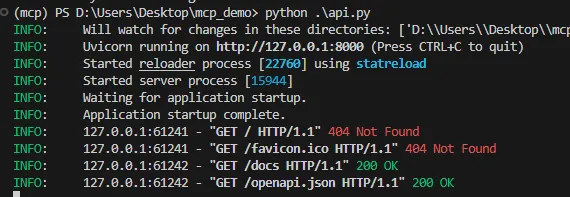
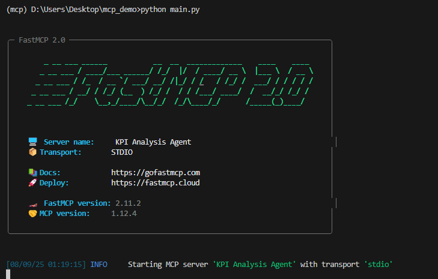
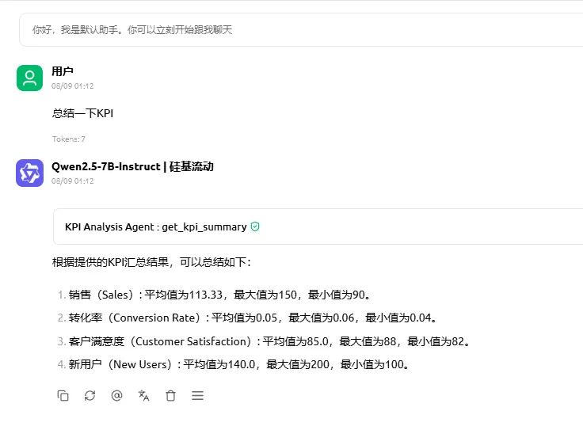

```markdown
# KPI Dashboard MCP Server

基于 FastAPI 与 FastMCP 构建的智能 KPI Dashboard 服务端。  
支持本地数据分析与智能体交互，适用于企业运营、业务监控、智能分析等场景。

---

## 🌟 项目亮点

- ✅ 使用 FastAPI 构建轻量高性能 HTTP 接口  
- 🤖 集成 FastMCP Server，支持与 MCP 客户端（如 Cherry Studio）智能对话  
- 📊 内置数据分析模块，无需外部数据库或 CSV 文件  
- 🔧 支持本地开发调试与 VS Code 插件使用  


---

## 🚀 快速开始

### 1. 克隆仓库

```bash
git clone https://github.com/zhangting-hit/mcp_demo.git
cd mcp_demo
```

### 2. 创建虚拟环境（可选）

```bash
python -m venv venv
# macOS/Linux:
source venv/bin/activate
# Windows:
venv\Scripts\activate
```

### 3. 安装依赖

```bash
pip install -r requirements.txt
```

---

## ▶️ 启动服务

### 启动 API 服务（默认端口 `8000`）

```bash
python api.py
```

访问文档地址：

* [http://127.0.0.1:8000/docs](http://127.0.0.1:8000/docs)

### 启动 MCP Server 服务（默认端口 `8080`）

```bash
python main.py
```

启动后输出：

```
FastMCP Server is running at http://localhost:8080
```

> 示例截图

> 
> 

---

## 🔗 Cherry Studio 中连接 MCP Server

1. 打开 Cherry Studio
2. 进入设置 → 添加 MCP 服务配置
3. 使用以下内容：

```json
{
  "name": "KPI Analysis Agent",
  "command": "D:\\Anaconda\\envs\\mcp\\python.exe",
  "args": [
    "D:/Users/Desktop/mcp_demo/main.py"
  ],
  "env": {
    "PYTHONUNBUFFERED": "1"
  }
}
```

连接成功后即可通过 Cherry 与 Agent 对话

> 

---

## 📡 API 接口说明

### `GET /kpi/summary`

返回 KPI 汇总结果。

#### 示例返回：

```json
{
  "total_sales": 150000,
  "conversion_rate": 0.035,
  "active_users": 3421
}
```

---

## 💡 示例：添加新的 KPI 分析逻辑

在 `helper.py` 中添加：

```python
def calculate_average_order_value(sales_data):
    return sum(s["amount"] for s in sales_data) / len(sales_data)
```

然后在 `api.py` 的 `/kpi/summary` 接口中使用它。

---

## 📚 技术栈

* [FastAPI](https://fastapi.tiangolo.com/)
* [FastMCP](https://github.com/zhplus/fastmcp)
* Python 3.8+

---

## 📌 常见问题

### Q: 访问 `http://127.0.0.1:8000/` 显示 404？

A: 直接访问根路径会返回 404，请使用以下路径：

* [http://127.0.0.1:8000/kpi/summary](http://127.0.0.1:8000/kpi/summary)
* [http://127.0.0.1:8000/docs](http://127.0.0.1:8000/docs)

---

## 🧑‍💻 开发者建议

* 可将 `data.py` 替换为数据库或外部接口数据源
* MCP Server 支持扩展上下文记忆、图表输出、多轮问答
* 可用于构建嵌入式知识库、BI 平台、客户运营分析系统等

---

## 📄 License

MIT License

